## Patterns

Name | 1D (line view, Y=value) | 2D (surface view, Z=value) | 3D (surface view, Z=time)
:--- | :---------------------: | :------------------------: | :-----------------------:
Constant |  | N/A | N/A
Checkered | N/A |  | N/A
Cylinders | N/A |  | N/A
Spheres | N/A | N/A | 

## Noise

In the order of "recommended to try first":

Name | 1D (line view, Y=value) | 2D (surface view, Z=value) | 3D (surface view, Z=time) | 4D (not renderered)
:--- | :---------------------: | :------------------------: | :-----------------------: | :-----------------:
OpenSimplex2 noise | N/A |  | 
OpenSimplex2 noise (smooth falloff) | N/A | N/A | 
Simplex noise |  |  | 
Simplex noise (smooth falloff) | N/A | N/A | 
OpenSimplex2S noise | N/A |  | [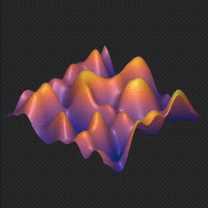](https://www.youtube.com/watch?v=7Ld2-UIoYCs)
OpenSimplex2S noise (smooth falloff) | N/A | N/A | [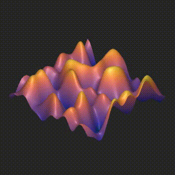](https://www.youtube.com/watch?v=fs0zFzc55l4)
OpenSimplex noise | N/A | [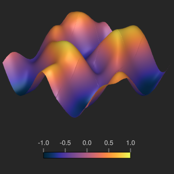](assets/algorithms/opensimplex_2d_full.png) | 
OpenSimplex noise (smooth falloff) | N/A | N/A | 
Perlin "Improved" noise | [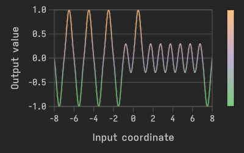](assets/algorithms/perlin_1d_full.png) |  | 
Value cubic noise |  |  | 
Value noise |  |  | 
Worley noise (Manhattan distance, F1) |  |  | 
Worley noise (Manhattan distance, F2) |  |  | 
Worley noise (Manhattan distance, F1 + F2) |  |  | [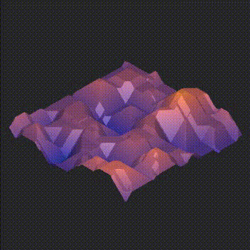](https://www.youtube.com/watch?v=0hfeXmizaSY)
Worley noise (Manhattan distance, F2 - F1) |  |  | 
Worley noise (Manhattan distance, F1 * F2) |  |  | 
Worley noise (Manhattan distance, F1 / F2) |  |  | [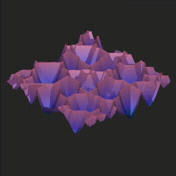](https://www.youtube.com/watch?v=HCGyPX1I-SQ)
Worley noise (Manhattan distance, cell value) |  |  | [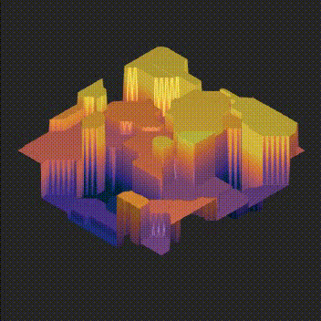](https://www.youtube.com/watch?v=5Yk9wamkP_w)
Worley noise (Euclidean distance, F1) |  |  | 
Worley noise (Euclidean distance, F2) |  |  | 
Worley noise (Euclidean distance, F1 + F2) |  |  | 
Worley noise (Euclidean distance, F2 - F1) |  |  | 
Worley noise (Euclidean distance, F1 * F2) |  |  | 
Worley noise (Euclidean distance, F1 / F2) |  |  | [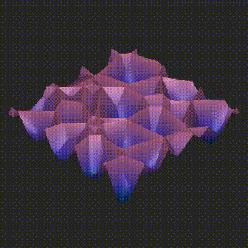](https://www.youtube.com/watch?v=VvrrFqFMyfU)
Worley noise (Euclidean distance, cell value) |  |  | 
Worley noise (Euclidean² distance, F1) |  |  | 
Worley noise (Euclidean² distance, F2) |  |  | 
Worley noise (Euclidean² distance, F1 + F2) |  |  | 
Worley noise (Euclidean² distance, F2 - F1) |  |  | 
Worley noise (Euclidean² distance, F1 * F2) |  |  | 
Worley noise (Euclidean² distance, F1 / F2) |  |  | 
Worley noise (Euclidean² distance, cell value) |  | [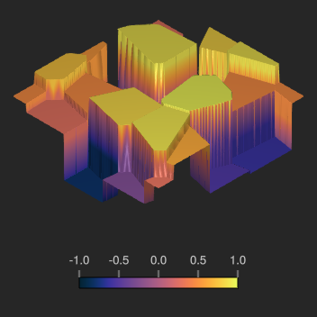](assets/algorithms/worley_2d_euclidean_squared_value_full.png) | 
Worley noise (Chebyshev distance, F1) |  |  | 
Worley noise (Chebyshev distance, F2) |  |  | 
Worley noise (Chebyshev distance, F1 + F2) |  |  | [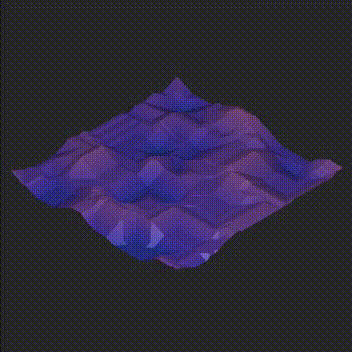](https://www.youtube.com/watch?v=Nl5BEYyzfnE)
Worley noise (Chebyshev distance, F2 - F1) |  |  | 
Worley noise (Chebyshev distance, F1 * F2) |  | [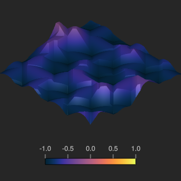](assets/algorithms/worley_2d_chebyshev_mul_full.png) | 
Worley noise (Chebyshev distance, F1 / F2) |  |  | [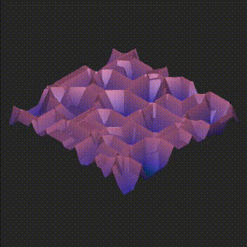](https://www.youtube.com/watch?v=P0tQRueoADM)
Worley noise (Chebyshev distance, cell value) |  |  | 
Worley noise (Minkowski4 distance, F1) |  | [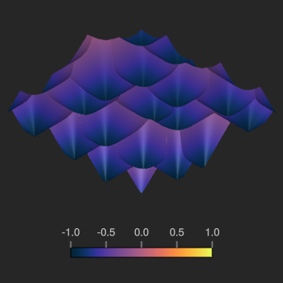](assets/algorithms/worley_2d_minkowski4_f1_full.png) | 
Worley noise (Minkowski4 distance, F2) |  |  | 
Worley noise (Minkowski4 distance, F1 + F2) |  |  | 
Worley noise (Minkowski4 distance, F2 - F1) |  | [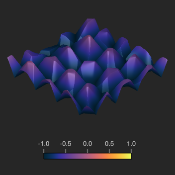](assets/algorithms/worley_2d_minkowski4_sub_full.png) | [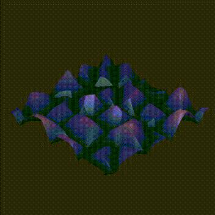](https://www.youtube.com/watch?v=8ESRjwnqnH4)
Worley noise (Minkowski4 distance, F1 * F2) |  |  | 
Worley noise (Minkowski4 distance, F1 / F2) |  | [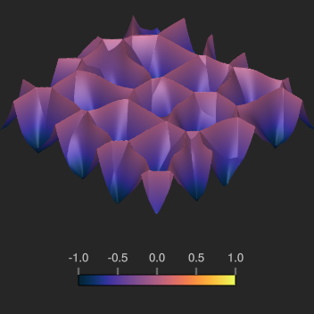](assets/algorithms/worley_2d_minkowski4_div_full.png) | [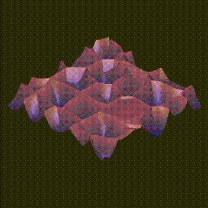](https://www.youtube.com/watch?v=_0rc3c_f5LQ)
Worley noise (Minkowski4 distance, cell value) |  | [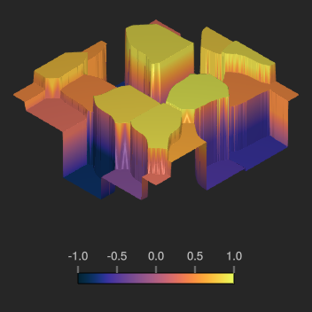](assets/algorithms/worley_2d_minkowski4_value_full.png) | 

## Fractals

Name | 1D  | 2D (surface view, Z=value) | 3D (surface view, Z=time) | 4D (not renderered)
:--- | :-: | :------------------------: | :-----------------------: | :-----------------:
fBm (OpenSimplex2 noise) | N/A |  | TODO | N/A
fBm (Simplex noise) |  |  | TODO | N/A
fBm (OpenSimplex2S noise) | N/A |  | TODO | N/A
fBm (OpenSimplex noise) | N/A |  | TODO | N/A
fBm (Perlin noise) |  | [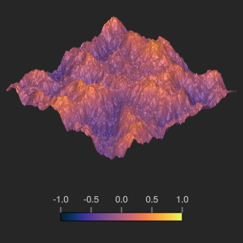](assets/algorithms/fbm_2d_perlin_full.png) | TODO | N/A
fBm (Value cubic noise) |  |  | TODO | N/A
fBm (Value noise) |  |  | TODO | N/A
fBm (Worley noise) |  |  | TODO | N/A
Billow (OpenSimplex2 noise) | N/A |  | TODO | N/A
Billow (Simplex noise) | [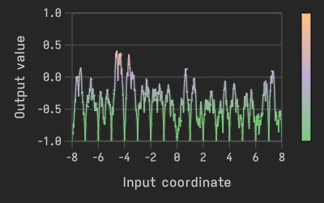](assets/algorithms/billow_1d_simplex_full.png) |  | TODO | N/A
Billow (OpenSimplex2S noise) | N/A |  | TODO | N/A
Billow (OpenSimplex noise) | N/A |  | TODO | N/A
Billow (Perlin noise) |  |  | TODO | N/A
Billow (Value cubic noise) |  |  | TODO | N/A
Billow (Value noise) |  |  | TODO | N/A
Billow (Worley noise) |  |  | TODO | N/A
Multi (OpenSimplex2 noise) | N/A |  | TODO | N/A
Multi (Simplex noise) |  |  | TODO | N/A
Multi (OpenSimplex2S noise) | N/A |  | TODO | N/A
Multi (OpenSimplex noise) | N/A |  | TODO | N/A
Multi (Perlin noise) |  |  | TODO | N/A
Multi (Value cubic noise) |  |  | TODO | N/A
Multi (Value noise) |  |  | TODO | N/A
Multi (Worley noise) |  |  | TODO | N/A
Hybrid (OpenSimplex2 noise) | N/A |  | TODO | N/A
Hybrid (Simplex noise) |  |  | TODO | N/A
Hybrid (OpenSimplex2S noise) | N/A |  | TODO | N/A
Hybrid (OpenSimplex noise) | N/A |  | TODO | N/A
Hybrid (Perlin noise) |  |  | TODO | N/A
Hybrid (Value cubic noise) |  |  | TODO | N/A
Hybrid (Value noise) |  |  | TODO | N/A
Hybrid (Worley noise) |  |  | TODO | N/A
Ridged (OpenSimplex2 noise) | N/A |  | TODO | N/A
Ridged (Simplex noise) |  |  | TODO | N/A
Ridged (OpenSimplex2S noise) | N/A |  | TODO | N/A
Ridged (OpenSimplex noise) | N/A |  | TODO | N/A
Ridged (Perlin noise) |  |  | TODO | N/A
Ridged (Value cubic noise) |  |  | TODO | N/A
Ridged (Value noise) |  |  | TODO | N/A
Ridged (Worley noise) |  |  | TODO | N/A
