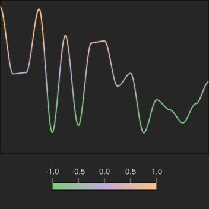
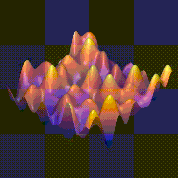
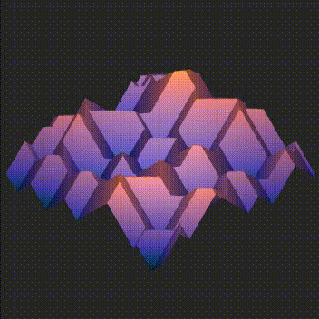
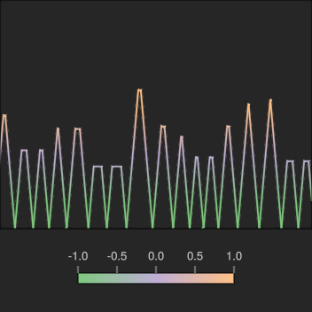
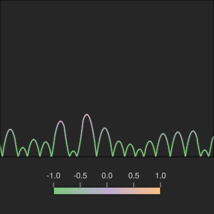
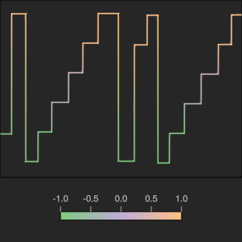
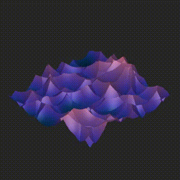
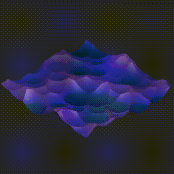

## Algorithms

Name | 1D (Y=value)  | 2D (surface view, Z=value) | 3D (surface view, Z=time)
:--- | :-- | :------------------------- | :------------------------
Value noise |  |  | 
Cubic noise |  |  | 
Perlin "Improved" noise |  |  | 
Simplex noise |  |  | 
Simplex noise (smooth falloff) |  |  | 
OpenSimplex noise | Not implemented |  | 
OpenSimplex noise (smooth falloff) | Not implemented |  | 
OpenSimplex2 noise | Not implemented |  | 
OpenSimplex2 noise (smooth falloff) | Not implemented |  | 
OpenSimplex2S noise | Not implemented |  | 
OpenSimplex2S noise (smooth falloff) | Not implemented |  | 
Worley noise (Manhattan distance, F1) |  |  | 
Worley noise (Manhattan distance, F2) |  |  | 
Worley noise (Manhattan distance, F1 + F2) |  |  | 
Worley noise (Manhattan distance, F2 - F1) |  |  | 
Worley noise (Manhattan distance, F1 * F2) |  |  | 
Worley noise (Manhattan distance, F1 / F2) |  |  | 
Worley noise (Manhattan distance, cell value) |  |  | 
Worley noise (Euclidean distance, F1) |  |  | 
Worley noise (Euclidean distance, F2) |  |  | 
Worley noise (Euclidean distance, F1 + F2) |  |  | 
Worley noise (Euclidean distance, F2 - F1) |  |  | 
Worley noise (Euclidean distance, F1 * F2) |  |  | 
Worley noise (Euclidean distance, F1 / F2) |  |  | 
Worley noise (Euclidean distance, cell value) |  |  | 
Worley noise (Euclidean² distance, F1) |  |  | 
Worley noise (Euclidean² distance, F2) |  |  | 
Worley noise (Euclidean² distance, F1 + F2) |  |  | 
Worley noise (Euclidean² distance, F2 - F1) |  |  | 
Worley noise (Euclidean² distance, F1 * F2) |  |  | 
Worley noise (Euclidean² distance, F1 / F2) |  |  | 
Worley noise (Euclidean² distance, cell value) |  |  | 
Worley noise (Chebyshev distance, F1) |  |  | 
Worley noise (Chebyshev distance, F2) |  |  | 
Worley noise (Chebyshev distance, F1 + F2) |  |  | 
Worley noise (Chebyshev distance, F2 - F1) |  |  | 
Worley noise (Chebyshev distance, F1 * F2) |  |  | 
Worley noise (Chebyshev distance, F1 / F2) |  |  | 
Worley noise (Chebyshev distance, cell value) |  |  | 
Worley noise (Minkowski4 distance, F1) |  |  | 
Worley noise (Minkowski4 distance, F2) |  |  | 
Worley noise (Minkowski4 distance, F1 + F2) |  |  | 
Worley noise (Minkowski4 distance, F2 - F1) |  |  | 
Worley noise (Minkowski4 distance, F1 * F2) |  |  | 
Worley noise (Minkowski4 distance, F1 / F2) |  |  | 
Worley noise (Minkowski4 distance, cell value) |  |  | 
